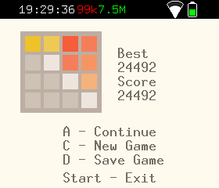
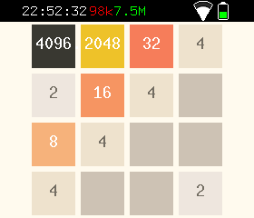

# Twenty Forty Eight (2048)

Класична гра 2048 для консолі lilka.dev (рушій MJS).

## Скріншоти

| Головний екран | Ігровий процес |
|---|---|
|  |  |

## Опис

Twenty Forty Eight — це реалізація популярної головоломки 2048. Пересувайте плитки з числами по полю 4×4, щоб об'єднувати однакові значення. Мета гри — досягти плитки з числом **2048**, але на цьому гра не закінчується 😉

- Поле 4×4 з кольоровими плитками
- Кожен хід додає нову плитку (2 або 4) у випадкову вільну клітинку
- Однакові плитки об'єднуються, подвоюючи значення
- Рекорд зберігається автоматично
- Можливість зберегти та продовжити гру пізніше

## Керування

| Кнопка | Дія |
|---|---|
| Стрілки | Рух плиток (вліво, вправо, вгору, вниз) |
| A | Старт / Продовжити / Нова гра |
| C | Нова гра |
| D | Зберегти гру |
| Start | Вихід |

## Запуск

Скопіюйте файли `twenty-forty-eight.js` на SD-карту пристрою.